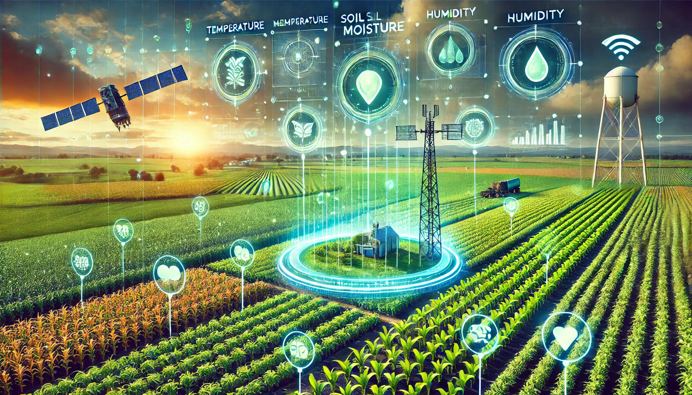

# 🌾🌐 **Virtual Sensors for Smart Farming: An IoT- and AI-Enabled Approach** 🌐🌾

  <strong>🌟 The data and the code will be made publicly available on GitHub once the paper "Virtual Sensors for Smart Farming: An IoT- and AI-Enabled Approach" is accepted. 🌟</strong>

---

  🚜💻🌱 
  <em>Stay tuned for cutting-edge innovations at the intersection of IoT, AI, and agriculture! 
  Follow this repository for updates. 🌟✨</em>

---

  📜📅 <strong>Paper Status:</strong> <em>Under Review</em> 📖🤓 
  📢 Updates will be posted here as soon as they become available! 🚀

  🛠️👨‍💻👩‍💻 
  <em>Let's revolutionize farming together!</em>

---

  

